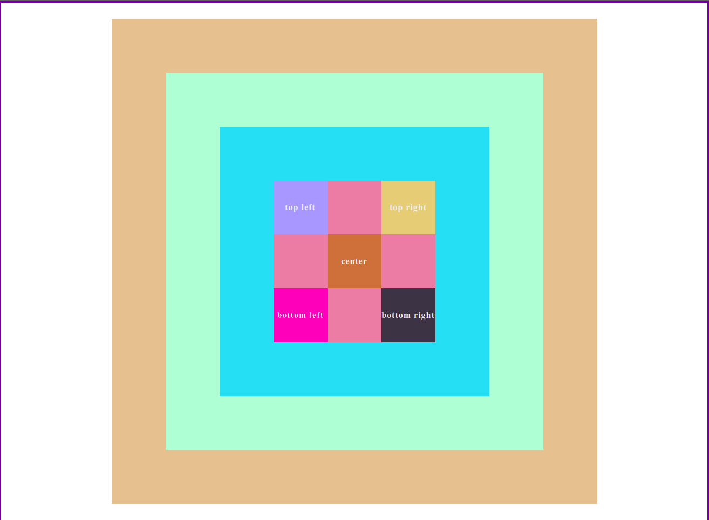

## Position

- Static
  - Valor default
- Absolute
  - Move o elemento para fora do fluxo normal. Se esse não tiver nenhum ancestral superior definido, irá levar em conta o ancestral mais próximo.

    

### Referências

- [Position - Mozilla](https://developer.mozilla.org/pt-BR/docs/Web/CSS/position)
- [Position - W3](https://www.w3schools.com/css/css_positioning.asp)
- [Z-index - Mozilla](https://developer.mozilla.org/en-US/docs/Web/CSS/z-index)
